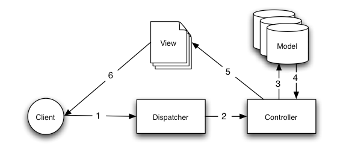

#Webコース - 自作Twitterクライアントを作ろう

##1. 環境の導入
###XAMPP
Web開発に必要な物がまとめて入っているツール。本来、Webアプリケーションはサーバー上で動かすものだが、XAMPPを入れると自分のPC上で実行できるようになる。

1. [ここ](https://www.apachefriends.org/jp/)から自分の使っているOSに合うものをダウンロード
2. 画面の指示に従ってインストール  


ちなみに入っているのは

- PHP -- プログラミング言語
-  MySQL(MariaDB) -- データベースシステム
-  Apache -- Webサーバー

###テキストエディタ
実際にプログラムを作っていく道具。Windowsのメモ帳やMaxのテキストエディットでも良いけれど、できればプログラミングに向いたものを使う(メ創ではEmacsやるのかな？)。今回はAtomというエディタを使う。

1. [ここ](https://atom.io)から自分の使っているOSに合うものをダウンロード。
2. そしてインストール。Macならアプリケーションフォルダに移動、Windowsなら```AtomSetup.exe```を実行。

###CakePHP
今回使用するフレームワーク。必要なプラグインなどをすでにいれてある。

1. [ここ](https://github.com/tcyyky/tel_practice_web)にアクセスして、```Download ZIP```をクリックしてダウンロード、解凍。
2. Mac:  ```/Applications/XAMPP/xamppfiles/htdocs/```   
    Win: ```C:¥xampp¥htdocs```にフォルダごと移動。 


###Twitterのアプリケーション登録
Twitter連携のアプリケーションを作る時に必要な作業。これをしておくことで、TwitterAPIというものが使えるようになるため、ツイートの取得などができるようになる。

1. Twitterに電話番号登録をしていない場合は先にする。[twitter.com/settings/add_phone](https://twitter.com/settings/add_phone)
2. [apps.twitter.com](http://apps.twitter.com)にアクセス。
3. ```Create New App```を押して下記のように入力。


4. agreeして```Create your Twitterapplication```を押す。
5. ```Keys and Access Tokens```のタブを開く。
6. ```Create my Access Token```を押す。
7. このページにある
	- Consumer Key
	- Consumer Secret
	- Acccess Token
	- Access Token Secret

	をコピーしてどこかにメモっておく

##2. Webアプリケーションとは？
ユーザーがブラウザからサーバー上のアプリケーションに対してリクエスト(例えば、「ツイートを見たい」)を送り、様々な結果(タイムラインのツイートのリスト)を動的に生成して返答するもの。必要に応じてアプリケーションはデータベースとも連携する。


###MVCアーキテクチャ
上記の図のWebアプリケーションの部分を設計するのに一番良く使われている方法MVCというもの。CakePHPでもMVCを採用している。



- まずユーザーからの要求がDispather(あんまり気にしなくていい)に送られ、Controllerが呼ばれる。
- ControllerはModelからデータを受け取ったり、またデータを保存してもらったりして、動的にViewを生成する。
- 生成されたViewがユーザーに返される。

詳しくは[http://book.cakephp.org/2.0/ja/cakephp-overview/understanding-model-view-controller.html](http://book.cakephp.org/2.0/ja/cakephp-overview/understanding-model-view-controller.html)参照

##3. 準備
__ここからはMacを基準に説明していきます。__

###CakePHPが動くようにする
####必要なソフトの起動
1. manager-osx.app開く。(WinはXampp Controll Panel)  

2. Manage Serversを開き、以下順でクリックする。  (WinはApacheとMySQLのStartボタンを押す) 


####データベースを作成
1. [http://127.0.0.1/phpmyadmin/server_databases.php](http://127.0.0.1/phpmyadmin/server_databases.php)にアクセス。
2. 以下の黄枠中を入力、選択。作成ボタンを押す。


####エディタでファイルを編集してデータベースを登録
1. Atom.appを開く  


2. [ファイル]→[開く]から```/Applications/XAMPP/xamppfiles/htdocs/tel_practice_web-master```を開き、サイドバーから```app/config/database.php```を以下のように変更する。  

ここを 

```php
	// $testじゃなくて$defaultであることに注意
	public $default = array(
		'datasource' => 'Database/Mysql',
		'persistent' => false,
		'host' => 'localhost',
		'login' => 'user',
		'password' => 'password',
		'database' => 'database_name',
		'prefix' => '',
		//'encoding' => 'utf8',
	);
```
こういうふうに変える

```php
	public $default = array(
		'datasource' => 'Database/Mysql',
		'persistent' => false,
		'host' => 'localhost',
		'login' => 'root',
		'password' => '',
		'database' => 'my_twitter_cliant',
		'prefix' => '',
		'encoding' => 'utf8',
	);
```
####tmpフォルダに書き込み権限を与える(Macのみ)
3. ターミナル.app を開く。  

4. 以下を実行

```bash
mkdir /Applications/XAMPP/xamppfiles/htdocs/tel_practice_web-master/app/tmp
chmod -R a+w /Applications/XAMPP/xamppfiles/htdocs/tel_practice_web-master/app/tmp
```

####準備完了
[http://127.0.0.1/cakephp](http://127.0.0.1/tel_practice_web-master)にアクセスしてこのようになれば準備OK


	
##4. タイムラインをつくる
以下で困ったときは[公式ドキュメント](http://book.cakephp.org/2.0/ja/)を見ると良いです。
ここからは基本的にAtomでの作業です。
###コントローラーを用意する
まず、コントローラーを作る。
CakePHPでコントローラーは1つのファイルに1つのクラスを定義することによ作成する。コントローラーの中で実装したい機能ごとにアクションと呼ばれるメソッドを作成する。

まず、ファイルを作成します(```cmd+N```で作成できます)。そしたらそのファイルを```TweetsController.php```として、```app/Controller```の中に保存してください。

以下を書きます。``//``のところはコメントなので写す必要はありません。

__TweetsController.php__

```php
<?php

App::import('Vendor','twitteroauth/autoload'); //TwitterAPIを使うための準備
use Abraham\TwitterOAuth\TwitterOAuth; //おまじない☆

//以下がコントローラ本体
class TweetsController extends AppController {
    //便利な機能を読み込んでいる
    public $helpers = ['Form'];
    public $uses = [];
    
    //Twitterの認証の用意
    private $twitter;
    
    //すべての機能に共通する処理を書くところ
    //ここではTwitter認証を行っている。
    public function beforeFilter(){
		$this->twitter = new TwitterOAuth(
			'取得したConsumer Key',
			'取得したConsumer Secret',
			'取得したAccess Token',
			'取得したAccess Token Secret'
		);
	}

	//ここにアクションを書いていく。

}
```

###ツイートを取得する
まずツイートを取得してTLを作ってみましょう。
まず、コントローラにindexアクションを追加します。

__TweetsController.php__

```php
//ここにアクションを書いていく。

//indexアクション
public function index()
{
        $tl = $this->twitter->get('statuses/home_timeline', ['count' => 200]); //Twitterに問い合わせてツイートを取得
        $this->set("tl", $tl); //Viewに取得したツイートを渡す
}
```

次に表示を行うためにビューを作っていきます。

まず、ファイルを作成します。そしたらそのファイルを```index.ctp```として、```app/View/Tweets```の中に保存してください。このviewファイルはHTMLの中にPHPを埋め込んでいるものです。

__index.ctp__

```php
<!-- ツイートをリストにして表示 -->

<ul>
<?php foreach($tl as $status):  ?>
	<li>
	    <?php echo $status->user->name.'(@'.$status->user->screen_name.')<br>'.$status->text ?>
	</li>
<?php endforeach; ?>
</ul>
```

[http://127.0.0.1/cakephp/tweets/](http://127.0.0.1/tel_practice_web-master/tweets/)にアクセスして自分のタイムラインが表示されていたらOK。


###ツイートを投稿する
投稿ができるようにします。

まず、コントローラーに投稿するための機能をpostTweetアクションとして追加します。

__TweetsController.php__

```php

//indexアクション
//----省略------

//postTweetアクション
public function postTweet(){
        $this->autoRender = false;
        $tweet = $this->request->data['tweet']; //送られてきた文を取得
        if(!empty($tweet)){
            $this->twitter->post('statuses/update', ['status' => $tweet]); //Twitterに文を送る
        }
        $this->redirect(['action' => 'index']); //元の画面に戻る
}
```

つぎに、ビューに投稿欄を追加します。

__index.ctp__

```php
<h4>ツイート</h4>
<?php
	echo $this->Form->create(null,['url' => ['action' => 'postTweet']]);
	echo $this->Form->input('tweet', ['name' => 'data[tweet]']);
	
	echo $this->Form->end('Tweet');
?>

<!-- ツイートをリストにして表示 -->
<!-- ----省略---- -->
```

ツイートできるかテストしてみましょう！
ここまで来たらひとまず完成です。

##5. 定型文機能を追加してみよう
###テーブルをデータベースに作成

[ここ](http://127.0.0.1/phpmyadmin/db_sql.php?db=my_twitter_cliant)にアクセスして、以下を入力

```sql
CREATE TABLE phrases (
    id INT UNSIGNED AUTO_INCREMENT PRIMARY KEY,
    phrase VARCHAR(50),
    created DATETIME DEFAULT NULL,
    modified DATETIME DEFAULT NULL
);
```
実行ボタンを押す。

###モデルの作成
まず、ファイルを作成する。そしたらそのファイルを```Phrase.php```として、```app/Model```の中に保存する。
以下を書く

__Phrase.php__

```php
<?php

App::uses('AppModel', 'Model');

class Phrase extends AppModel {
    
}
```

###ビューとコントローラの編集
コントローラの

- indexアクションに定型文をデータベースから取得する処理を追加
- 定型文を追加するaddPhraseアクションを作成

__TweetsController.php__

```php
    public $helpers = ['Form'];
    public $uses = ['Phrase']; // Phraseを追加
    private $twitter;

    public function beforeFilter(){
        //省略
    }
    
    public function index()
    {
        var_dump($phrases);
        $tl = $this->twitter->get('statuses/home_timeline', ['count' => 200]);
        $this->set("tl", $tl);

        $phrases = $this->Phrase->find('all'); //追加
        $this->set("phrases", $phrases); //追加
    }

    public function postTweet(){
       //省略
    }

	//定型文を追加するアクション
    public function addPhrase(){
        $this->Phrase->save($this->request->data);
        $this->redirect(['action' => 'index']);
    }
```

ビューに以下の部分を追加

- 定型文を表示する
- 定型文を追加する

__index.ctp__

```php
<h4>定型文</h4>
<?php foreach ($phrases as $phrase) : ?>
<?php
	echo $this->Form->create(null,['url' => ['controller' =>'Tweets', 'action' => 'postTweet']]);
	echo $this->Form->hidden('content', ['name' => 'data[tweet]', 'value' => $phrase['Phrase']['content']]);
	echo $this->Form->end($phrase['Phrase']['content']);
?>
<?php endforeach; ?>

<h4>定型文を追加</h4>
<?php
	echo $this->Form->create('Phrase',['url' => ['controller' => 'Tweets', 'action' => 'addPhrase']]);
	echo $this->Form->input('content');
	echo $this->Form->end('定型文を追加');
?>

<h4>ツイート</h4>
<!-- ----省略---- -->
```

以下のようになっていたら完成！(定型文は自分で作成したもの)

